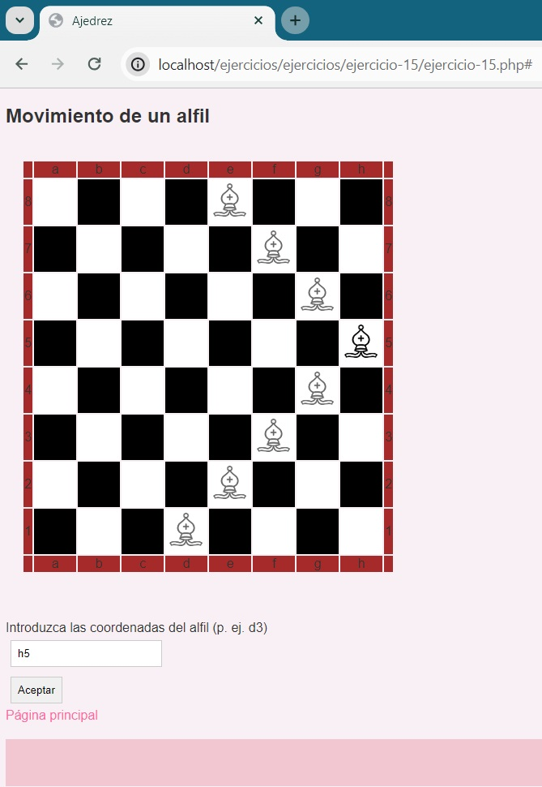

# Alfil-PHP

# Ajedrez: Movimiento de un alfil

Este proyecto consiste en una página web interactiva que muestra el movimiento de un alfil en un tablero de ajedrez. Los usuarios pueden ingresar las coordenadas del alfil y ver cómo se mueve en el tablero.

## Funcionalidades

- Visualización del tablero de ajedrez con la posición del alfil.
- Interfaz simple para ingresar las coordenadas del alfil.
- Actualización dinámica del tablero al ingresar nuevas coordenadas.

## Captura 

**Interfaz**

